## CSC3150 Homework2

叶树谦 115010269

#### Q1   Use of UNIX/LINUX Shell Commands

##### The design of solution

The photo filename, 8-digitstudent ID and 4-digit programme code are separated by a tab in each line, and in the end of `matching.txt`, there should be an empty line. The shell command may not in the home directory, so `$HOME` is used to locate the home directory.

Use `cat` and `while` to read `matching.txt` line by line. And then use `cut` to split each line to find out the information needed included file name, student id and program code.

Verify whether the input is valid. File do not exist, ID is not 8-digit, programme code is not 4-digit, and the student ID is duplicated should be consider to ensure the robustness of the program. When meet this error, skip this turn of processing and output the error.

If all the information is right, rename and move the file into the right path using `mv`. If the sub folder do not exist, use `mkdir` to create one.

##### Source code

```bash
#!/bin/bash
# This is the solution to Q1

declare -a students # store the student ID to find out duplication
declare -i i
i=1


cat "$HOME/matching.txt" | while read -r line # read each line in matching.txt
do 
    name=`echo $line | cut -d' '  -f 1` # find out the original file name
    id=`echo $line | cut -d' ' -f 2` # find out the matched ID
    code=`echo $line | cut -d' ' -f 3` # find out the programme code should in
    
    
    if [ ! -f "$HOME/student_photo/"$name ]; then
        # check wheather the photo exist
        echo "$name does not exist, so it cannot be renamed and moved."
        continue
    fi

    if ! echo "$id" | grep -q '^[0-9]\+$'; then
        # check wheather the ID is valid
        echo "$id is an invalid 8-digit student ID, so $name is not renamed and moved."
        continue
    else
        if [ ! ${#id} -eq 8 ] ; then
            echo "$id is an invalid 8-digit student ID, so $name is not renamed and moved."
            continue
        fi
    fi

    if ! echo "$code" | grep -q '^[0-9]\+$'; then
        # check wheather the programme code is valid
        echo "$code is an invalid 4-digit programme code, so $name is not renamed and moved."
        continue
    else
        if [ ! ${#code} -eq 4 ]; then
            echo "$code is an invalid 4-digit programme code, so $name is not renamed and moved."
            continue
        fi
    fi

    if ! echo "${students[@]}" | grep -w $id &>/dev/null; then
        # check wheather the ID is repeated
        students[$i]=$id
        i=i+1
    else
        echo "$id is a duplicate student ID, so $name is not renamed and moved."
        continue
    fi
    

    name="$HOME/student_photo/"$name
    # the original path
    students[$i]=id
    code="$HOME/student_photo/"$code

    if [ ! -d $code ]; then
        # if the folder do not exist, creat it
        mkdir $code
    fi

    path=$code"/"$id".jpg"
    mv $name $path # move to the new folder and rename
done
```

##### Test cases

1. There is no error.

   The text in `matching.txt` is below.

   > DSC0001.jpg    05123456    1561
   >
   > DSC0002.jpg    05135554    1543
   >
   > DSC0003.jpg    05468871    1286
   >
   > DSC0004.jpg    05978585    1561
   >
   > ​
   >
   > ​

   The files in the folder `student_photo` before running the code is liked below.

   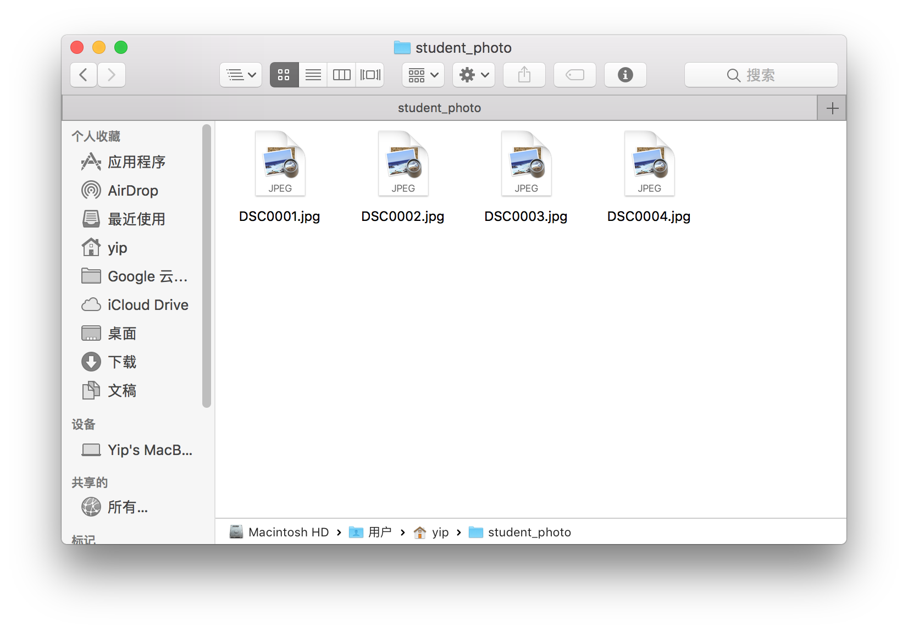

   After running in the shell command in terminal, there is no error.

   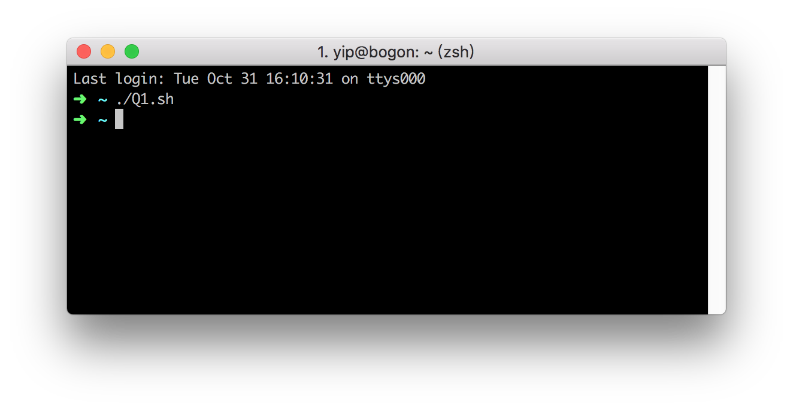

   And the photos are renamed and removed successfully.

   

2. There is a photo file that do not exist.

   The text in `matching.txt` is the same as in part 1.

   The files in the folder `student_photo` before running the code is liked below.

   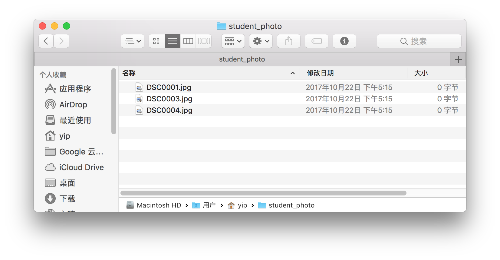

   After running in the shell command in terminal, an error was shown liked below, and other photo has been managed.

   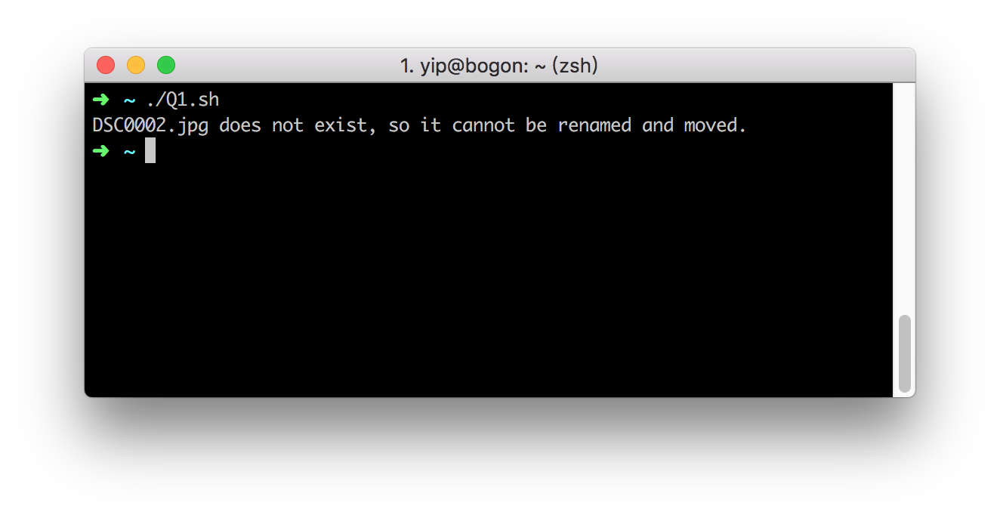

   

3. There is an invalid 8-digit student ID.

   The text in `matching.txt` is below.

   > DSC0001.jpg    0512345a    1561
   >
   > DSC0002.jpg    051355542   1543
   >
   > DSC0003.jpg    05468871    1286
   >
   > DSC0004.jpg    05978585    1561
   >
   > ​
   >
   > ​

   The files in the folder `student_photo` before running the code is the same as in part 1.

   After running in the shell command in terminal, an error was shown liked below, and other photo has been managed.

   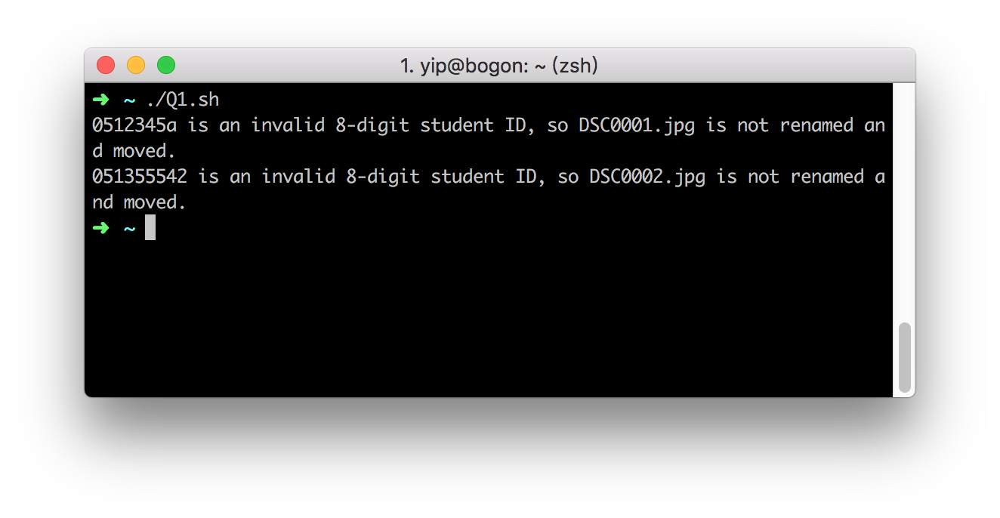

   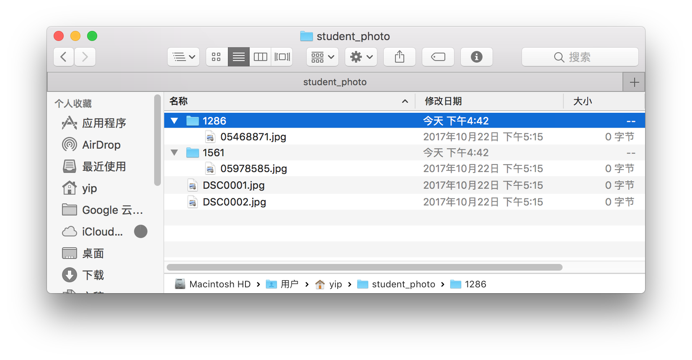

4. There is an invalid 4-digit programme code.

   The text in `matching.txt` is below.

   > DSC0001.jpg    05123456    156a
   >
   > DSC0002.jpg    05135554    15432
   >
   > DSC0003.jpg    05468871    1286
   >
   > DSC0004.jpg    05978585    1561
   >
   > ​
   >
   > ​

   The files in the folder `student_photo` before running the code is the same as in part 1.

   After running in the shell command in terminal, an error was shown liked below, and other photo has been managed.

   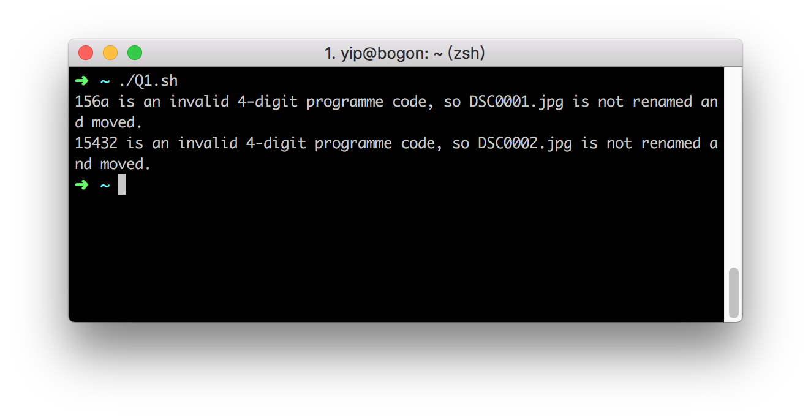

   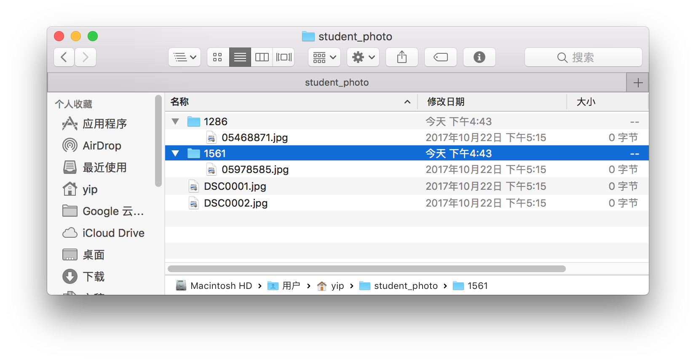

5. There is a duplicate student ID.

   The text in `matching.txt` is below.

   > DSC0001.jpg    0512345a    1561
   >
   > DSC0002.jpg    051355542   1543
   >
   > DSC0003.jpg    05468871    1286
   >
   > DSC0004.jpg    05978585    1561
   >
   > ​

   The files in the folder `student_photo` before running the code is the same as in part 1.

   After running in the shell command in terminal, an error was shown liked below, and other photo has been managed.

   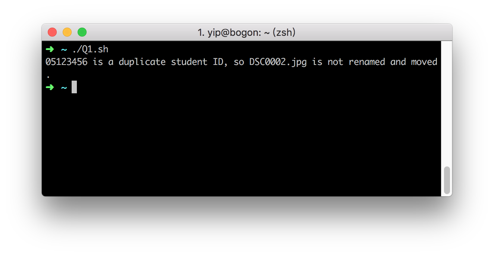

   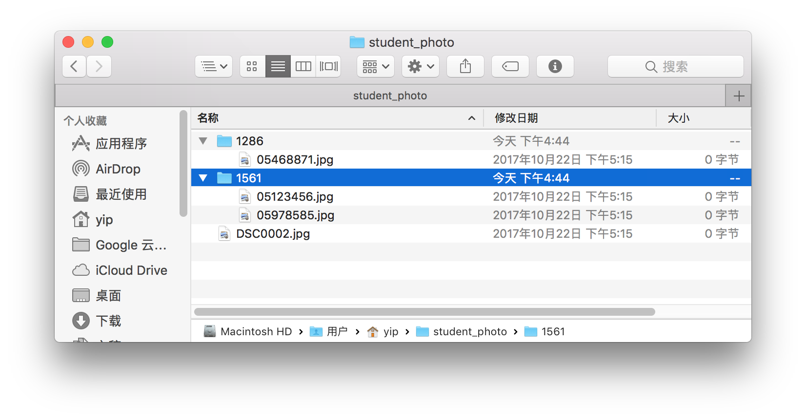

   #### Q2 Programming interface for process control in UNIX/LINUX

##### The design of solution

Input arguments in `main()` function into `*argv[]`, and use `atoi()` to transfer character into interger.

Using shared memory to store the variable `idata`,  and using System V semaphore to cordinate concurrent processes. Define a `key_t` type variable `shm_key` to storage the IPC key. Using `memset()`, `shmat()` to put `idata` into the shared memory.

Define 3 functions `sem_set()`, `sem_p()` and `sem_v()` to control the semaphore. 

Include `time.h` to get the current time, and use `fork()` function to create child process. Justify the PID of current processing the identify which process it is and run different code. 

Using `sleep()` to control the after time, and use `asctime()`, `localtime()` and `time()` functions to get and print current time.

##### Source code

(After tested, the code commted during line 24 to 28 is needed in Linux, but not in macOS.)

```c
/* This is the solution to Q2.
 */
#include <time.h>
#include <stdio.h>
#include <stdlib.h>
#include <string.h>
#include <errno.h>
#include <unistd.h>
#include <sys/types.h>
#include <sys/ipc.h>
#include <sys/shm.h>
#include <sys/sem.h>

#define FILENAME "/dev/null"

// System V semaphore relative variable
int sem_set(int sem_id);
int sem_p(int sem_id);
int sem_v(int sem_id);

// // !!! The code below should be commted to run in macOS,
// //     but it is needed to run in Linux.
// union semun{  
//     int val;  
//     struct semid_ds *buf;  
//    unsigned short *arry;  
// };  

int main(int argc, char *argv[])
{
    int t1, t2, t3, t4, t5, t6;
    pid_t child1, child2, grandchild;

    t1 = atoi(argv[2]); // get time data from arguments
    t2 = atoi(argv[3]);
    t3 = atoi(argv[4]);
    t4 = atoi(argv[5]);
    t5 = atoi(argv[6]);
    t6 = atoi(argv[7]);

    // shared memory
    key_t shm_key = ftok(FILENAME, 0); // get the IPC key
    if(shm_key == -1){
        perror("ftok");
        exit(EXIT_FAILURE);
    }

    int shm_size = getpagesize(); // set shared memory size
    int shm_id = shmget(shm_key, shm_size, 0644 | IPC_CREAT);
    if(shm_id == -1){
        perror("shmget");
        exit(EXIT_FAILURE);
    }

    int *idata = (int *)shmat(shm_id, NULL, 0); // put idata into shared memory

    if(idata == (int *)-1){
        perror("shmat");
        exit(EXIT_FAILURE);
    }

    memset(idata, 0, shm_size);

    key_t sem_key = shm_key; // set semaphore key
    int sem_id = semget(sem_key, 1, 0644 | IPC_CREAT); // set semaphore ID
    if(sem_id == -1){
        perror("semget");
        exit(EXIT_FAILURE);
    }

    if(sem_set(sem_id) == -1){
        perror("sem_set");
        exit(EXIT_FAILURE);
    }


    *idata = atoi(argv[1]); // get initial idata from argument
    printf("PID\trole\t\tidata\ttime\n");

    // parent process
    time_t rawtime; // time relatived variable
    struct tm * timeinfo;
    time(&rawtime); // get the current time
    timeinfo = localtime(&rawtime);

    printf("%4d\tparent\t\t\t%s\n", getpid(), asctime(timeinfo)); // print process created infomation
    fflush(stdout);

    sleep(t1);

    child1 = fork(); // creat first child process
    if (child1 < 0) {
        perror("fork first child");
        exit(EXIT_FAILURE);
    }

    if (child1 == 0)
    {
        //first child process
        time(&rawtime);
        timeinfo = localtime(&rawtime);
        printf("%4d\tfirst child\t\t%s\n", getpid(), asctime(timeinfo));
        fflush(stdout);

        sleep(t3);

        if(sem_p(sem_id) == -1){ // semaphore wait
            perror("sem_p(first child)");
            exit(EXIT_FAILURE);
        }

        *idata += 1;

        time(&rawtime);
        timeinfo = localtime(&rawtime);
        printf("%4d\tfirst child\t%d\t%s\n", getpid(), *idata, asctime(timeinfo)); // print procee terminated information

        if(sem_v(sem_id) == -1){ // semaphore signal
            perror("sem_v(first child)");
            exit(EXIT_FAILURE);
        }

        if(shmdt(idata) == -1){ // disconnect shared memory
            perror("shmdtv(first child)");
            exit(EXIT_FAILURE);
        }

        fflush(stdout);
        exit(0); // terminate first child
    }


    else
    {
        sleep(t2);
        child2 = fork(); //create second child
        if (child1 < 0){
            perror("fork second child");
            exit(EXIT_FAILURE);
        }
        if (child2 == 0)
        {
            // second child process
            time(&rawtime);
            timeinfo = localtime(&rawtime);
            printf("%4d\tsecond child\t\t%s\n", getpid(), asctime(timeinfo)); // print process created infomation
            fflush(stdout);

            sleep(t5);

            grandchild = fork(); // grandchild proces
            if (child1 < 0){
                perror("fork grandchild");
                exit(EXIT_FAILURE);
            }
            if (grandchild == 0)
            {
                time(&rawtime);
                timeinfo = localtime(&rawtime);
                printf("%4d\tgrandchild\t\t%s\n", getpid(), asctime(timeinfo)); // print procee terminated information
                fflush(stdout);

                sleep(t6);

                if(sem_p(sem_id) == -1){ // semaphore wait
                    perror("sem_p(grandchild)");
                    exit(EXIT_FAILURE);
                }

                *idata += 1;

                time(&rawtime);
                timeinfo = localtime(&rawtime);
                printf("%4d\tgrandchild\t%d\t%s\n", getpid(), *idata, asctime(timeinfo));

                if(sem_v(sem_id) == -1){ // semaphore signal
                    perror("sem_v(grandchild)");
                    exit(EXIT_FAILURE);
                }

                if(shmdt(idata) == -1){ // disconnect shared memory
                    perror("shmdt(grandchild)");
                    exit(EXIT_FAILURE);
                }

                fflush(stdout);
                exit(0); // terminate grandchild
            }


            else{
                // second child process

                sleep(t4);

                if(sem_p(sem_id) == -1){ // semaphore wait
                    perror("sem_p(second child)");
                    exit(EXIT_FAILURE);
                }

                *idata += 1;


                time(&rawtime);
                timeinfo = localtime(&rawtime);
                printf("%4d\tsecond child\t%d\t%s\n", getpid(), *idata, asctime(timeinfo));// print procee terminated information

                if(sem_v(sem_id) == -1){ // semaphore signal
                    perror("sem_v(second child)");
                    exit(EXIT_FAILURE);
                }

                if(shmdt(idata) == -1){ // disconnect shared memory
                    perror("shmdt(second child)");
                    exit(EXIT_FAILURE);
                }

                fflush(stdout);
                exit(0); // termiate second child
            }
        }


        else
        {
            // parent process
            if(sem_p(sem_id) == -1){ // semaphore wait
                perror("sem_p(parent)");
                exit(EXIT_FAILURE);
            }

            *idata += 1;


            time(&rawtime);
            timeinfo = localtime(&rawtime);
            printf("%4d\tparent\t\t%d\t%s\n", getpid(), *idata, asctime(timeinfo)); // print procee terminated information

            if(sem_v(sem_id) == -1){ // semaphore signal
                perror("sem_v(parent)");
                exit(EXIT_FAILURE);
            }

            if(shmdt(idata) == -1){ // disconnect shared memory
                perror("shmdt(parent)");
                exit(EXIT_FAILURE);
            }

            fflush(stdout);
            return 0; // terminate parent process
        }
    }

    return 0;
}


int sem_set(int sem_id){ // set the semaphore
    union semun sem_u;
    sem_u.val = 1;

    if(semctl(sem_id, 0, SETVAL, sem_u) == -1){
        return -1;
    }else{
        return 0;
    }
}

int sem_p(int sem_id){ // semaphore wait
    struct sembuf sem_b[1];
    sem_b[0].sem_num = 0;
    sem_b[0].sem_op = -1;
    sem_b[0].sem_flg = SEM_UNDO;

    if(semop(sem_id, sem_b, 1) == -1){
        return -1;
    }else{
        return 0;
    }
}

int sem_v(int sem_id){ // semaphore signal
    struct sembuf sem_b[1];
    sem_b[0].sem_num = 0;
    sem_b[0].sem_op = 1;
    sem_b[0].sem_flg = SEM_UNDO;

    if(semop(sem_id, sem_b, 1) == -1){
        return -1;
    }else{
        return 0;
    }
}

```

   ​
##### Test cases

1. The parent outlives then the child. Let $idata = 0, t_1=0, t_2=0,t_3=0,t_4=4,t_5=1,t_6=1$.

The running result is below.

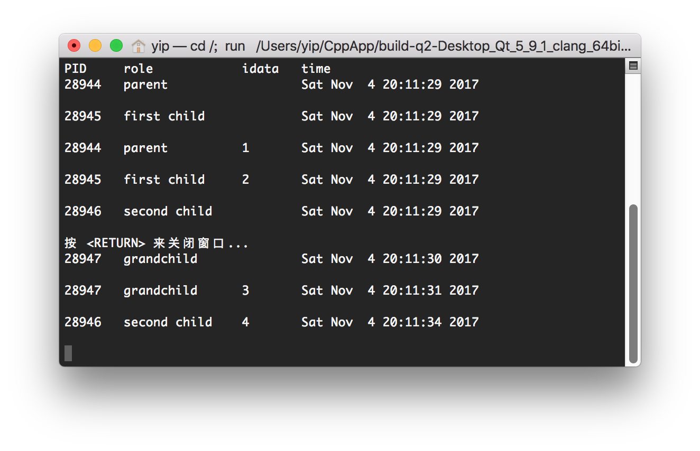

We can see the process `28947` is the child of `28946`, so the parent outlives than the child. `idata` can be count correctlly.

2. the (orphaned) child outlives the parent. $idata = 0, t_1=0, t_2=0,t_3=1,t_4=0,t_5=0,t_6=0$.The running result is below.

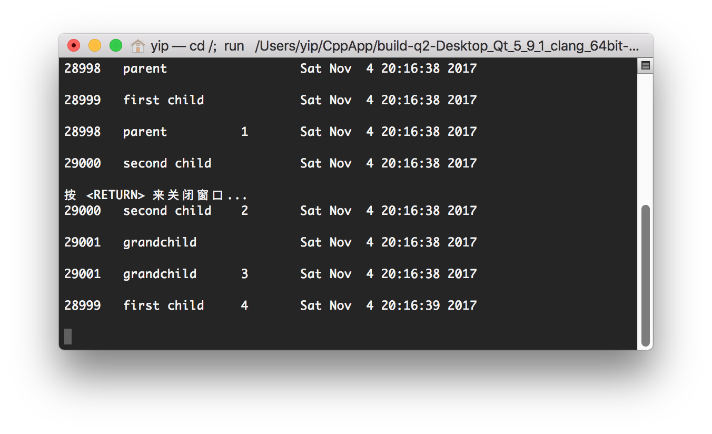

We can see the process `28998` as the parent, is the first process terminated in all 4 processes. And the opphaned child processes still can run normally and output the correct `idata`. 

So, we can conclude that the parent need not to wait for its child to terminate.

3. Let $idata = 0, t_1=0, t_2=0,t_3=0,t_4=0,t_5=0,t_6=0$.

The running result is below.

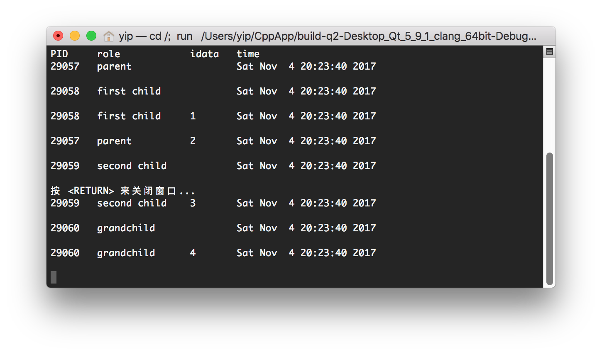

This situation is that the child run fastest, due to it do not need any sleeping, the first child still terminate before the parent, which means he child terminates before its parent has had a chance to wait.

4. Let $idata = -1, t_1=1, t_2=1,t_3=1,t_4=1,t_5=1,t_6=1$.


  The running result is below.

  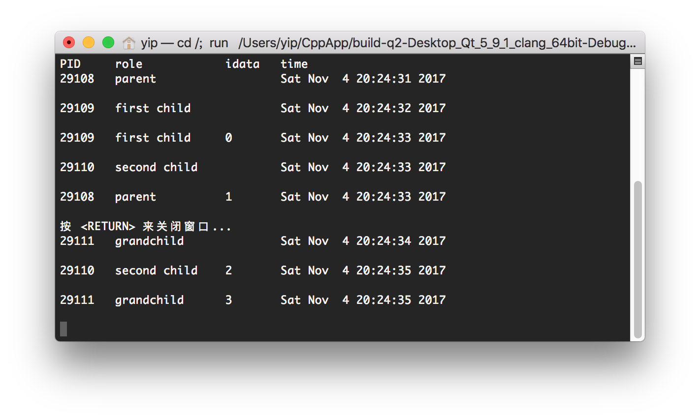